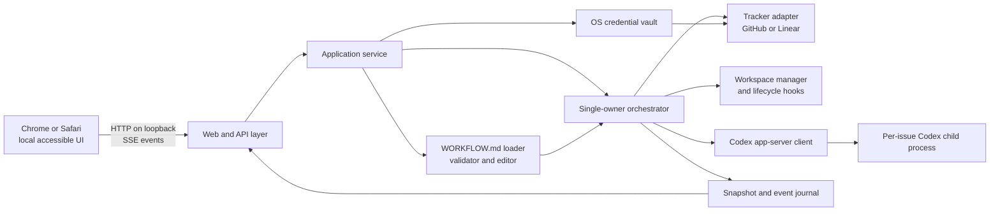

# Symphony Accessible Cross-Platform Application Design

- **Status:** Approved interactively; awaiting review of this written contract
- **Date:** 2026-08-06
- **Primary specification:** [OpenAI Symphony `SPEC.md`](https://github.com/openai/symphony/blob/3c372fa1f32a4d573a7bb9fa0cc101e16add63c3/SPEC.md), pinned at commit `3c372fa1f32a4d573a7bb9fa0cc101e16add63c3`
- **Codex protocol target:** Codex CLI/app-server `0.144.1`, with generated JSON schemas vendored and reviewed at implementation time
- **Implementation language target:** Go `1.26.5`

## 1. Purpose

Build a local, browser-based Symphony implementation that runs on Windows and macOS, schedules coding-agent work from either GitHub repository issues or a Linear project, and gives an operator an accessible, modern dark user interface.

The application conforms to the pinned upstream Symphony service contract. Where that contract intentionally leaves behavior implementation-defined, this document selects and records the behavior. GitHub tracking, the configuration editor, the browser dashboard, OS credential-vault storage, and accessibility requirements are implementation extensions; they must not weaken core Symphony semantics.

The complete rendered user interface is in scope for WCAG 2.2 Level A and AA. The primary assistive-technology/browser combinations are:

- Windows: NVDA with current stable Google Chrome.
- macOS: VoiceOver with current stable Safari.

The application does not need an installer. It must be runnable from source or a built executable, and its loopback web interface must be usable from the supported browsers on either platform.

## 2. Goals

- Implement all core behavior required by the pinned Symphony specification: workflow loading and dynamic reload, typed configuration, tracker polling, eligibility, deterministic workspace handling, bounded dispatch, reconciliation, retry, Codex app-server integration, structured observability, and restart recovery from tracker and filesystem state.
- Support exactly one configured tracker scope per running process: one GitHub repository or one Linear project.
- Permit multiple independent Symphony processes on the same computer for multiple repositories or projects.
- Provide complete UI configuration for tracker selection and scope, OS-vault credentials, workspace settings, runtime policy, and the repository-owned `WORKFLOW.md`.
- Keep the browser server local to the machine and protect state-changing endpoints against cross-site requests.
- Meet every applicable WCAG 2.2 A and AA success criterion, with explicit rationale for criteria that are not applicable to this product.
- Use runtime accessibility automation with Playwright and axe-core; permit A11yNow as an additional runtime scanner; and run `a11y-check-web scan` as a pre-commit source gate.
- Make failures understandable and recoverable through both structured logs and accessible UI status.

## 3. Non-goals

- Linux support.
- A native desktop shell, installer, auto-updater, or operating-system tray integration.
- A remote or multi-tenant dashboard.
- Multiple tracker scopes inside one process. Operators use one independently configured process per repository/project.
- A persistent scheduler database or exact restoration of in-memory retry timers after restart.
- A general workflow engine beyond the upstream Symphony contract.
- Orchestrator-owned ticket business logic. Tracker writes remain provider-native agent tools, consistent with the upstream boundary.
- SSH or other remote-worker execution.
- First-party repository checkout policy. Repository preparation remains workflow-defined through hooks.

## 4. Supported environment and compatibility policy

### 4.1 Operating systems and architectures

The release matrix is:

| Platform | Minimum | Architectures | Browser and screen reader |
| --- | --- | --- | --- |
| Windows | Windows 11 | x86-64 and ARM64 where the Go and Codex toolchains support it | Current stable Chrome and current stable NVDA |
| macOS | macOS 14 | Apple Silicon and x86-64 | Current stable Safari and built-in VoiceOver |

Linux builds, Linux CI, and Linux-specific credential or shell adapters are out of scope. Exact browser, screen-reader, OS, Codex, and Go versions used for a release are recorded in its verification report because assistive-technology behavior changes independently of the application.

### 4.2 Runtime prerequisites

- A compatible `codex` executable available to the Symphony process.
- Git and any repository-specific tools invoked by `WORKFLOW.md` hooks.
- Bash on both platforms for `codex.command`, because the upstream launch contract requires `bash -lc <codex.command>`. On Windows the supported source is Git for Windows. Startup validation fails with an actionable error if Bash cannot be found.
- Outbound access to the selected tracker API and to services used by Codex. This does not expose the dashboard remotely.

### 4.3 Version compatibility

The implementation targets Codex app-server `0.144.1`. A generated schema snapshot for that exact version is committed with a manifest containing the Codex version, schema digest, and generation command. Startup performs a Codex version/capability preflight. A version mismatch blocks dispatch unless its protocol schema digest is explicitly listed as compatible; the UI remains available to explain the failure.

Go `1.26.5` is the initial toolchain pin. The module and CI files pin the chosen language and dependency versions so the two platform builds are reproducible.

## 5. Architecture

### 5.1 Shape

The application is a single Go process with a local HTTP server and child Codex app-server processes. It uses server-rendered HTML as the durable interaction model. Small progressive-enhancement modules provide server-sent event updates, focus-safe dialogs, and editor conveniences; core navigation, inspection, configuration, start/stop, and error recovery remain usable without client-side routing.



The dashboard is an optional status surface in upstream terms. Correctness never depends on a browser connection. Closing the browser does not pause workers, and an SSE disconnection does not alter orchestration state.

### 5.2 Package boundaries

The planned source layout is:

```text
cmd/symphony/                 CLI entry point and process lifecycle
internal/app/                 Composition, commands, queries, and runtime status
internal/domain/              Provider-neutral issue and orchestration types
internal/workflow/            WORKFLOW.md parse, validate, render, watch, and edit
internal/orchestrator/        Single-authority state machine, scheduling, reconciliation
internal/tracker/             Adapter contract
internal/tracker/github/      GitHub repository-issues adapter and github_api tool
internal/tracker/linear/      Linear project adapter and linear_graphql tool
internal/workspace/           Safe paths, lifecycle, hooks, and cleanup
internal/codex/               Version preflight, JSONL RPC, sessions, tools, cancellation
internal/secrets/             OS-vault interface and macOS/Windows implementations
internal/observability/       Structured logs, event journal, metrics, redaction
internal/web/                 HTTP server, auth, CSRF, handlers, view models
web/templates/                Server-rendered HTML templates
web/static/                   Local CSS, minimal JavaScript, and icons
schema/codex/0.144.1/         Generated app-server schema snapshot and manifest
tests/                        Cross-package, browser, conformance, and fixtures
```

Dependencies point inward toward `domain` and narrow interfaces. Tracker payloads, Codex wire objects, HTML view models, and filesystem objects do not leak into the orchestration state model.

### 5.3 Core interfaces

The logical boundaries are:

```go
type Tracker interface {
    FetchIssuesByStates(ctx context.Context, states []string) ([]domain.Issue, error)
    FetchIssuesByIDs(ctx context.Context, ids []string) ([]domain.Issue, error)
    AgentTools(session TrackerSession) []codex.ToolSpec
    ExecuteAgentTool(ctx context.Context, call codex.ToolCall, session TrackerSession) codex.ToolResult
    SecretEnvironmentNames() []string
}

type WorkspaceManager interface {
    Ensure(ctx context.Context, issue domain.Issue, config workflow.Config) (domain.Workspace, error)
    RunHook(ctx context.Context, hook domain.Hook, workspace domain.Workspace) error
    RemoveTerminal(ctx context.Context, issue domain.Issue, config workflow.Config) error
}

type AgentRunner interface {
    Run(ctx context.Context, request domain.RunRequest, emit func(domain.AgentEvent)) domain.RunResult
}

type SecretStore interface {
    Put(ctx context.Context, ref SecretRef, value []byte) error
    Get(ctx context.Context, ref SecretRef) ([]byte, error)
    Delete(ctx context.Context, ref SecretRef) error
    Status(ctx context.Context, ref SecretRef) SecretStatus
}
```

Exact Go signatures may evolve during implementation, but the direction and responsibilities are contractual. In particular, credentials never appear in `domain.Issue`, session snapshots, event payloads, templates, logs, or browser responses.

## 6. Process and instance model

### 6.1 One scope per process

Each process selects one `WORKFLOW.md` and therefore one tracker adapter and one provider scope. This intentionally keeps the upstream single-authority state machine simple and makes failure and credential boundaries visible.

Multiple processes are supported by:

- A default HTTP port of `0`, allowing the OS to choose an unused loopback port.
- An optional explicit port for stable bookmarks and automation.
- A default data directory derived from a stable hash of the canonical workflow path and tracker scope.
- Independent structured log and ephemeral event files per instance.
- A non-blocking instance lock keyed by the canonical workflow path. Starting the same workflow twice fails before dispatch and reports the existing instance when discoverable. Different workflows can run concurrently.

The canonical path is resolved through symlinks before computing the lock and instance ID. A lock guards duplicate orchestration, not browser sessions; multiple local browser tabs can observe one instance.

### 6.2 CLI modes

Run mode:

```text
symphony [path-to-WORKFLOW.md] [--port N] [--data-dir PATH] [--open]
```

- The workflow path defaults to `./WORKFLOW.md`, matching upstream precedence.
- Missing or invalid workflow content fails run-mode startup with a typed, operator-visible error and a non-zero exit status, as required by the upstream startup preflight. The operator uses configuration mode to create or repair the file.
- `--port 0` is the default.
- CLI `--port` overrides `server.port`; when neither is supplied this product still starts its required UI on an ephemeral loopback port. A reloaded port change is reported as restart-required rather than hot-rebinding.
- `--open` asks the OS to open the protected local URL; it is optional and never required for accessibility.

Configuration mode:

```text
symphony configure [path-to-WORKFLOW.md] [--port N] [--data-dir PATH] [--open]
```

- Configuration mode never starts polling or workers.
- It may create a missing `WORKFLOW.md` after explicit save.
- It exposes validation, credential setup, and the raw/structured workflow editor.
- Transition to active orchestration requires leaving configuration mode and starting run mode with a valid workflow. The UI does not silently change process mode.

Both modes print the exact local URL and an accessible plain-text startup/error summary to standard error.

## 7. Workflow and configuration contract

### 7.1 Upstream behavior

`WORKFLOW.md` remains the repository-owned source of policy. The loader implements the pinned specification exactly:

- Explicit path before current-directory `WORKFLOW.md`.
- Optional YAML front matter followed by a trimmed Markdown prompt body.
- Front matter must decode to a mapping.
- Unknown keys are preserved and ignored by core code when unrecognized.
- Strict Liquid-compatible prompt rendering; unknown variables and filters fail.
- Typed defaults, targeted `$VAR_NAME` resolution, path expansion, and path resolution relative to the workflow file.
- Filesystem change detection and dynamic reload.
- Invalid reload retains the last known good effective configuration, blocks unsafe new dispatch where required, and emits a visible error. It does not replace live configuration with a partial parse.
- Reloaded values affect future polls, reconciliation decisions, retries, hooks, prompts, and sessions as specified; an in-flight tracker/tool/session snapshot is immutable.

The structured editor is a view over the same file, not a second configuration database.

### 7.2 Tracker extension schema

The core schema's `tracker.provider` object is adapter-owned. This implementation defines:

```yaml
tracker:
  kind: github
  provider:
    owner: openai
    repository: example
    endpoint: https://api.github.com
    credential_ref: os-vault
    assignee: optional-login
  required_labels: [symphony]
  active_states: [open]
  terminal_states: [closed]
```

```yaml
tracker:
  kind: linear
  provider:
    project_slug: example-project
    endpoint: https://api.linear.app/graphql
    credential_ref: os-vault
  required_labels: [symphony]
  active_states: [Todo, In Progress]
  terminal_states: [Closed, Cancelled, Canceled, Duplicate, Done]
```

Rules:

- `credential_ref: os-vault` instructs the adapter to obtain the credential from the native vault under the instance ID and tracker kind. The literal credential is never written to `WORKFLOW.md`.
- For compatibility with authored workflows, documented token fields may contain `$VAR_NAME`; environment resolution follows upstream rules. The UI never writes a literal token and labels environment-backed credentials as externally managed.
- GitHub scope is exactly one repository. The adapter reads repository Issues and excludes pull requests even though GitHub's issue API can return both.
- GitHub identifiers are provider-stable repository-qualified references internally and human-readable `#number` values in the UI. `native_ref` retains owner, repository, issue node/database ID, and number for provider tools.
- GitHub dispatch supports optional assignee filtering and the core required-label filter. Labels normalize to trimmed lowercase.
- Linear scope is exactly one project. The adapter normalizes project issues, labels, state, priority, timestamps, URL, branch metadata, and blockers into the shared model. `native_ref` retains the provider-specific identifiers required by `linear_graphql`.
- Adapter validation distinguishes authentication, authorization, missing scope, invalid state, rate limit, transport, and schema errors.

The browser-server extension is also repository-configurable:

```yaml
server:
  port: 0
  operator_response_timeout_ms: 600000
```

`server.port` accepts `0` or an available TCP port from `1` through `65535`; it always binds loopback and a runtime change requires restart. `server.operator_response_timeout_ms` must be a finite duration of at least `30000 ms`, defaults to ten minutes, and governs each approval/user-input response window. The UI warns at least 20 seconds before expiry and permits ten simple extensions of the same duration, creating a finite hard limit of eleven windows. CLI `--port` has higher precedence than the file.

### 7.3 Configuration editing

The Configuration page has two synchronized editing paths:

1. A structured form for supported fields, with native controls, persistent labels, descriptions, units, constraints, defaults, and inline plus summary errors.
2. A full raw `WORKFLOW.md` editor for the YAML and Markdown prompt contract.

Saving structured fields patches a YAML abstract syntax tree so comments, ordering, scalar style, prompt text, and unknown/extension keys are preserved. Saving the raw editor parses and validates the complete candidate. Both paths use the same transaction:

1. Read the current file and compare its digest with the editor's base digest.
2. If it changed externally, reject the save with a conflict view containing the current file and the user's unsaved text; never overwrite silently.
3. Parse, type-check, template-parse, and run adapter/config validation that does not require dispatch.
4. Write a temporary file in the same directory with restrictive permissions.
5. Flush the file, atomically replace the destination, and flush the parent directory where the OS supports it.
6. Wait for the workflow watcher to load the exact new digest and report effective/invalid status.

Secrets save independently to the OS vault. The credential field supports replace and delete actions but never reveals the existing value. UI, logs, HTTP bodies, test artifacts, and process arguments use only a presence/status indicator.

## 8. Domain and orchestration semantics

### 8.1 Normalized issue

The provider-neutral `Issue` contains all upstream fields: stable `id`, nullable non-secret `native_ref`, human `identifier`, title, nullable description, nullable priority, state, nullable branch name, nullable URL, nullable `assignee_id`, normalized labels, normalized blocker references, explicit `dispatchable`, and nullable creation/update timestamps. Provider data required only for native tools remains in `native_ref` and is not interpreted by the scheduler.

State comparison trims surrounding whitespace and lowercases. Label comparison also trims and lowercases. UI display retains the provider's human casing.

### 8.2 Single-owner state machine

One orchestrator goroutine owns all mutable scheduling state: running sessions, claims, retry entries, latest issue snapshots, aggregate usage, and rate limits. Poll timers, watcher updates, worker events, operator start/stop commands, approval responses, and snapshot requests enter through typed messages. Workers never mutate shared maps.

The lifecycle is the upstream `Unclaimed -> Claimed -> Running/RetryQueued -> Released` model. A successful Codex turn or worker exit does not imply the tracker issue is terminal; the worker can continue on the same thread, and later polling can claim still-eligible work again.

### 8.3 Eligibility and order

The selected adapter supplies candidate issues with an explicit `dispatchable` value. The orchestrator applies only the provider-neutral core filters: active but non-terminal state, `dispatchable=true`, all required labels, concurrency totals, per-state caps, and not already running or claimed. It never reconstructs provider eligibility from `native_ref` or blocker payloads. The Linear adapter sets `dispatchable=false` for a `Todo` issue with any blocker outside the configured terminal states and otherwise applies its documented project/routing rules; the GitHub adapter sets it false for pull requests, out-of-scope records, and optional-assignee mismatches.

Eligible work is sorted deterministically:

1. Priorities `1` through `4`, lower first.
2. Any other or null priority after those values.
3. Oldest non-null `created_at` first; null timestamps last.
4. Stable human identifier as the final tie-breaker.

This order is covered by table and property tests so tracker response order cannot influence dispatch.

### 8.4 Retry and continuation

- A normal worker exit that leaves the issue eligible schedules continuation attempt `1` after `1000 ms`.
- Failure attempt `n` uses `min(10000 * 2^(n-1), agent.max_retry_backoff_ms)`, with the upstream default maximum of `300000 ms`.
- Retry entries retain issue ID, best-effort identifier, one-based attempt, monotonic due time, and concise redacted error.
- Slot exhaustion does not lose a retry; it requeues with an explicit reason.
- A terminal, inactive, missing, or label-ineligible issue cancels its worker/retry and releases its claim as defined upstream.
- After process restart, exact timers are not restored. The next tracker poll and startup terminal cleanup reconstruct eligible work and filesystem cleanup state.

The implementation uses a clock/timer interface for deterministic tests, and backoff arithmetic saturates before multiplication can overflow.

## 9. Workspace and subprocess safety

### 9.1 Workspace paths

- Expand and normalize the configured workspace root to an absolute path.
- Resolve symlinks for the deepest existing parent and re-check canonical containment after directory creation.
- Derive the workspace key by allowing only `[A-Za-z0-9._-]` and replacing other characters with `_`.
- If sanitization changes the identifier, append a stable SHA-256 suffix exposing at least 64 bits to prevent collisions.
- Use path-aware relative containment checks (`filepath.Rel` plus component rules), not string-prefix checks.
- Reject an existing non-directory, any path escape, symlink/reparse-point escape, or root/path identity ambiguity.
- Never remove the workspace root. Cleanup accepts only a validated child path associated with a terminal issue and revalidates immediately before removal.

### 9.2 Hooks

All four upstream hooks are supported: `after_create`, `before_run`, `after_run`, and `before_remove`.

- The working directory is the validated issue workspace.
- macOS executes hook scripts through `/bin/sh -lc`.
- Windows executes hook scripts through PowerShell using standard input, not command-line interpolation. The selected shell and its version are logged at startup.
- Default timeout is `60000 ms` and is configurable through `hooks.timeout_ms`.
- `after_create` and `before_run` failure/timeout fail the relevant workspace/run operation.
- `after_run` and `before_remove` failure/timeout are visible warnings and do not replace the primary outcome.
- Output is bounded, decoded safely, redacted, streamed into the issue activity log, and never inserted into HTML without escaping.

### 9.3 Codex process lifetime

`codex.command` is launched through `bash -lc` in the validated issue workspace on both supported systems. Windows startup validation locates Git for Windows Bash or fails with a remediation link. The command string itself follows upstream semantics and is never assembled from browser input.

Each worker owns a process group on macOS and a Job Object on Windows. Cancellation first sends graceful protocol cancellation/termination, waits a bounded interval, and then terminates the entire process tree. Application shutdown stops new dispatch, cancels workers, drains bounded final events/logs, and releases the instance lock.

Tracker-secret environment variables declared by the selected adapter are removed from the Codex child's environment. The initial list includes `GH_TOKEN`, `GITHUB_TOKEN`, and `LINEAR_API_KEY`, plus any explicit `$VAR_NAME` used for the active provider credential. Host-side tracker tools use a captured adapter/session configuration and vault handle rather than child environment credentials.

## 10. Codex app-server integration

### 10.1 Protocol source and transport

The generated schema and official documentation for the targeted Codex version control wire behavior. Symphony does not hand-maintain a competing protocol model.

For target `0.144.1`:

- Start `codex app-server` over standard input/output.
- Exchange newline-delimited JSON messages; diagnostic standard error is read and logged separately.
- Send `initialize`, receive its response, then send `initialized` before other methods.
- Start or resume a thread using the targeted `thread/start` or thread-resume contract, then start turns with `turn/start`.
- Parse and emit thread, turn, and item notifications and handle app-server requests such as approvals and user input.
- Reuse the same live thread for in-worker continuation turns and pass continuation guidance rather than the original prompt.
- Use a bounded JSON line reader with a maximum line size of 10 MB. Oversize, malformed, unknown, and out-of-sequence messages produce typed events without merging stderr into the protocol stream.

All request IDs, responses, cancellations, timeouts, subprocess exits, and terminal turn signals are modeled explicitly. Duplicate or late messages cannot complete a different request.

### 10.2 Policies

The default posture is operator-visible and bounded:

- `approval_policy` defaults to the targeted Codex policy that requests approval for operations requiring elevation.
- `thread_sandbox` and turn sandbox defaults restrict file writes to the issue workspace. Codex network access is disabled unless the workflow deliberately selects a supported policy that enables it.
- Approval and user-input requests appear in the issue detail page and a global Requests region. Each includes issue, requested action, risk-relevant parameters, and an explicit response deadline.
- The default operator response window is `600000 ms`. It is configurable and finite; the warning and ten-extension policy above provide time adjustment without disabling the upstream no-indefinite-stall rule.
- On timeout or browser-independent shutdown, Symphony returns the targeted protocol's denial/cancellation response where possible, marks the turn failed, and hands the result to normal retry policy.
- An operator response is accepted exactly once, checked against the active session and request ID, audit-logged without secrets, and rejected if stale.

Codex enum-like values remain validated pass-through values sourced from the vendored schema. The UI derives options and descriptions from the pinned compatible set rather than inventing values.

### 10.3 Provider-native tools

Tool specifications and execution remain adapter-owned and are captured at session start.

- Linear advertises `linear_graphql` with input `{ "query": string, "variables"?: object }`. The query must contain exactly one GraphQL operation; shorthand containing only the query string is also accepted. Queries and mutations are permitted, execute once against the captured endpoint/auth, and return `{ "success": boolean, "data"?: object, "errors"?: array, "error"?: object }`. HTTP success with top-level GraphQL errors sets `success` to false while preserving a bounded, redacted GraphQL body. An ambiguous mutation transport failure is never automatically replayed.
- GitHub advertises `github_api`, constrained to the configured repository and current issue. Its input is `{ "operation": enum, "issue_number"?: positive_integer, "input"?: object, "idempotency_key"?: string }`. If `issue_number` is present it must equal the active issue's captured `native_ref.number`; Symphony supplies owner/repository itself. Supported operations are `get_issue`, `update_issue`, `list_comments`, `create_comment`, `set_labels`, `add_assignees`, and `remove_assignees`. `update_issue` accepts only `title`, `body`, `state`, `state_reason`, and `milestone`; each other mutation accepts only the provider fields implied by its operation. Pull-request records are rejected by this issue tool. Results use `{ "success": boolean, "status": integer, "request_id"?: string, "data"?: object, "error"?: object }` with bounded, redacted data.
- GitHub GET operations are safe to retry. Set/update operations use provider set semantics where available. `create_comment` requires an `idempotency_key`; Symphony deduplicates that key within the captured session and never automatically replays a mutation after an ambiguous transport failure. The adapter honors provider rate-limit headers, returns retry metadata, and does not follow a redirect outside the configured API origin.
- Neither tool returns request authorization headers or vault values.
- Unsupported tools receive a structured failure response so the session does not stall.
- Workflow reload affects future sessions; an active session continues with the exact adapter kind, scope, endpoint, tool schemas, and credential reference it advertised.

## 11. Tracker behavior

### 11.1 GitHub repository Issues

The GitHub adapter:

- Uses the configured GitHub API endpoint and one owner/repository scope.
- Paginates deterministically and obeys conditional/rate-limit headers.
- Reads issues, filters out entries containing pull-request metadata, and optionally filters by assignee.
- Maps `open` and `closed` to normalized states while retaining provider state reason in `native_ref`.
- Normalizes labels, priority when a documented repository convention provides it, timestamps, URL, body, and issue identity.
- Treats GitHub API errors atomically: a failed page or malformed response fails that fetch rather than returning a silently incomplete candidate set.
- Exposes tracker writes only through the scoped `github_api` agent tool.

GitHub Issues do not natively provide the same blocker model as Linear. The initial GitHub adapter reports an empty `blocked_by` list unless blocker relations are available through an explicitly implemented, tested repository convention. It never infers blockers from unstructured issue text.

### 11.2 Linear project

The Linear adapter:

- Uses GraphQL against the configured endpoint and project slug.
- Fetches active candidates, state refreshes by stable ID, terminal issues for startup cleanup, and normalized blocker relationships.
- Treats top-level GraphQL errors as operation failure even when HTTP transport succeeds, preserving a bounded redacted response for diagnosis.
- Preserves native IDs required for provider operations without exposing them as scheduler policy.
- Exposes writes through the upstream-compatible `linear_graphql` tool.

### 11.3 Tracker failure semantics

- Empty state/ID inputs return an empty result without a provider request. State-list results may omit an individually malformed record only with an operator-visible diagnostic because it was never safe to dispatch. An ID-refresh result is complete, unique by dispatch ID, and unordered; any malformed requested record fails the whole refresh because omission has orchestration meaning.
- Candidate-fetch failure logs a visible error and skips new dispatch for that poll.
- Running-state refresh failure logs the error and leaves active workers running.
- Startup terminal-cleanup fetch failure logs a warning and allows startup to continue.
- Authentication and authorization errors produce a persistent Configuration/Overview alert and do not trigger aggressive request retries.
- Rate-limit responses publish the reset estimate and suppress requests until a bounded retry time with jitter.
- No fetch mutates the orchestrator from a partial result.

## 12. Local web server and security

### 12.1 Network boundary

The server listens only on loopback. It binds both loopback families when supported without falling back to wildcard interfaces. There is no option for LAN/public binding in this product scope.

The application makes outbound calls only to the configured tracker endpoint and through the separately launched Codex runtime. Browser assets, fonts, icons, scripts, and styles are packaged locally; the UI loads no CDN, analytics, telemetry pixel, or remote content.

### 12.2 Local browser authorization

Loopback alone does not prevent a malicious website from submitting requests to local services. Every process therefore creates a high-entropy one-time bootstrap capability:

1. The CLI prints/opens a URL containing the capability in its query string.
2. The server validates it with constant-time comparison, sets a random `HttpOnly`, `SameSite=Strict`, host-only session cookie, and redirects to the same path without the capability.
3. The capability expires after first successful exchange or a short startup window.
4. Requests without a valid session receive a simple local authorization page explaining how to obtain a fresh launch URL; no application state is disclosed.

All state-changing requests require a session-bound CSRF token, same-origin `Origin`/`Sec-Fetch-Site` checks where available, strict method/content-type validation, and a validated loopback Host header. Session cookies are rotated on process restart and never written to logs.

Security response headers include a restrictive nonce- or hash-based Content Security Policy, `default-src 'self'`, no remote connections except same-origin SSE, `frame-ancestors 'none'`, `base-uri 'none'`, `form-action 'self'`, `object-src 'none'`, `X-Content-Type-Options: nosniff`, `Referrer-Policy: no-referrer`, and explicit no-store caching for authenticated HTML/API responses.

### 12.3 HTTP and event contract

HTML routes:

- `/` — Overview.
- `/issues` — filterable issue queue and running/retry states.
- `/issues/{identifier}` — issue, run, requests, events, and bounded logs.
- `/activity` — chronological system activity.
- `/configuration` — structured and raw workflow configuration plus credential status.
- `/logs` — searchable structured application logs.

The API preserves the upstream optional status-server contract and adds UI operations under `/api/v1`:

- `GET /api/v1/state` — authoritative snapshot containing running, retrying, totals, rate limits, config status, and scheduler status.
- `GET /api/v1/{issue_identifier}` — one issue/session detail snapshot, preserving the upstream status-server route.
- `GET /api/v1/events` — SSE stream.
- `POST /api/v1/refresh` — request a tracker poll.
- `POST /api/v1/runtime/start` and `/stop` — operator scheduler controls, subject to mode/config validation.
- `POST /api/v1/config/validate` and `/save` — configuration transaction endpoints.
- `POST /api/v1/requests/{id}/respond` — approval or user-input response.

JSON error bodies have a stable code, safe summary, optional field errors, correlation ID, and retryability. They never contain HTML, stack traces, raw upstream bodies, credentials, or full prompts.

SSE events carry a monotonically increasing per-process sequence, type, timestamp, and small view-safe payload. The browser sends `Last-Event-ID` when reconnecting. If the requested sequence has fallen out of the bounded journal or belongs to a previous process, the server emits a reset event and the browser fetches a full snapshot. Event rendering is idempotent.

### 12.4 Trust boundary

This is a local-operator application for a trusted workstation, not a security boundary between mutually hostile machine users. The operator and repository-owned `WORKFLOW.md` hooks are trusted to execute commands. Tracker content, linked content, Codex output, browser input, local websites, and unsolicited loopback requests are untrusted.

Workspace containment, child environment stripping, Codex sandbox/approval policy, scoped tracker tools, and loopback web authorization reduce risk but do not turn arbitrary agent execution into a fully isolated VM. Documentation states that a permissive Codex policy or malicious trusted hook can modify data available to the host account. The application never auto-expands its filesystem, tracker, or inbound-network authority to recover from a failed operation.

## 13. User interface design

### 13.1 Information architecture

The persistent navigation order is Overview, Issues, Activity, Configuration, and Logs. A skip link precedes the navigation. Each route has a unique document title, one `<h1>`, stable landmarks, and a route-specific status summary.

Overview prioritizes:

- Service identity and selected repository/project.
- Scheduler state with text plus icon, never color alone.
- Active, queued, retrying, and needs-attention counts.
- Running session cards with issue link, state, elapsed time, latest meaningful event, turn count, and stop action.
- Persistent configuration/tracker errors.

Issues uses a real HTML table at wide widths and a semantically equivalent list presentation when reflow requires it. It supports GET-backed filters and sorting so results remain linkable and work without JavaScript. Rows are not clickable containers; the issue identifier/title is a normal link and actions are buttons.

Issue detail places operator requests before the event/log stream, then issue metadata, current run, retry history, activity, and logs. High-volume logs are not live-announced.

Configuration groups tracker, credential, workspace, orchestration, Codex policy, hooks, and raw workflow. Destructive actions such as credential deletion use a named confirmation dialog. Save returns focus to the initiating button on success or the error summary on failure.

### 13.2 Dark visual system

The approved default theme is dark and modern, with clear depth and quiet decoration:

| Token | Value | Use |
| --- | --- | --- |
| `--color-bg` | `#090e15` | Page background |
| `--color-surface-1` | `#0d1420` | Navigation and primary panels |
| `--color-surface-2` | `#121b29` | Cards and form groups |
| `--color-surface-3` | `#182436` | Elevated/interactive surfaces |
| `--color-border` | `#304159` | Default borders and dividers |
| `--color-border-strong` | `#47607f` | Emphasized boundaries |
| `--color-text` | `#f4f7fb` | Primary text |
| `--color-muted` | `#b1bfd2` | Secondary text |
| `--color-accent` | `#65dcc7` | Links and selected states |
| `--color-accent-strong` | `#4fc6b1` | Active controls with tested foreground |
| `--color-focus` | `#ffd166` | Focus indicator |
| `--color-success` | `#83e7a3` | Success decoration with text/icon |
| `--color-danger` | `#ff929a` | Error decoration with text/icon |

Token presence does not prove conformance. Every foreground/background, component state, focus indicator, chart/icon, and forced-colors behavior is measured in tests and reviewed in rendered browsers. Status styling always includes visible text; icons use current color and have an accessible name only when they add meaning.

The interface uses system font stacks, no remote font, restrained shadows, and no decorative motion. At `prefers-reduced-motion: reduce`, transitions and smooth scrolling are disabled. At `forced-colors: active`, native system colors and visible borders/focus indicators replace decorative tokens.

### 13.3 Interaction and responsive behavior

- All controls use native HTML elements unless a custom widget has a proven need and full keyboard/AT implementation.
- Pointer targets are at least 44 by 44 CSS pixels except inline text links or unavoidable user-agent controls, exceeding WCAG 2.2 AA's minimum.
- Focus uses a solid 3 CSS-pixel indicator with sufficient contrast and an offset so it is not clipped or obscured by sticky content.
- The layout reflows at 320 CSS pixels without two-dimensional scrolling. Log/code regions may scroll horizontally as the WCAG reflow exception, with surrounding labels and controls remaining visible.
- Text remains usable at 200% text resize and 400% browser zoom.
- No action depends on drag, path gestures, hover, color, device motion, or a single character shortcut.
- Hover/focus disclosures are dismissible, hoverable, and persistent; essential information is also available inline or on focus.
- Automatic updates do not move focus, reorder the focused element, open dialogs, or announce every event. User-initiated DOM replacement preserves or deliberately restores focus.

## 14. Accessibility contract

### 14.1 Engineering rules

- Semantic landmarks (`header`, `nav`, `main`, and scoped complementary/footer regions), logical heading hierarchy, lists, tables, descriptions, and fieldsets express relationships without CSS or ARIA reconstruction.
- Accessible names begin with or contain the visible label. Icon-only buttons have stable names; decorative icons are hidden from the accessibility tree.
- Each form control has a persistent visible label and, where needed, programmatically associated help, format, units, and error text. Placeholder text is never the sole label/instruction.
- Validation failures produce an error summary linked to fields and move focus to that summary only after the user submits. Live field validation is polite and does not interrupt typing.
- A single concise `role=status`/polite live region reports user-initiated success and non-urgent state changes. A dedicated assertive alert is reserved for urgent failures. Logs, timers, token counts, and routine SSE updates are silent.
- Dialogs use the native `<dialog>` element only after cross-AT verification; otherwise a standards-based modal with initial focus, contained tab order, Escape behavior, labelled title/description, background inertness, and focus restoration is used.
- Tables have captions and header associations. Responsive presentation does not destroy relationships or duplicate content in the accessibility tree.
- Loading and empty states are textual. `aria-busy` is scoped to the updating region, never left stuck, and does not replace a visible status.
- Timestamps use visible local time plus machine-readable `<time datetime>`. Relative timers never provide the only time information.
- Errors identify cause and remediation without exposing secrets. Authentication is never based on memory puzzles, transcription, CAPTCHA, or forced password re-entry.

### 14.2 WCAG 2.2 A/AA success-criterion ledger

Every A/AA criterion has an implementation and verification disposition. “Not applicable” is a product constraint, not permission to ignore the criterion if future content changes.

| SC | Level | Design disposition and verification |
| --- | --- | --- |
| 1.1.1 Non-text Content | A | Meaningful icons receive text alternatives/names; decorative icons are hidden. axe plus accessibility-tree and manual screen-reader checks. |
| 1.2.1 Audio-only and Video-only (Prerecorded) | A | Not applicable: the product ships no prerecorded audio or video. Adding it requires an equivalent alternative. |
| 1.2.2 Captions (Prerecorded) | A | Not applicable: no prerecorded synchronized media. |
| 1.2.3 Audio Description or Media Alternative (Prerecorded) | A | Not applicable: no prerecorded synchronized media. |
| 1.2.4 Captions (Live) | AA | Not applicable: no live audio content. |
| 1.2.5 Audio Description (Prerecorded) | AA | Not applicable: no prerecorded video. |
| 1.3.1 Info and Relationships | A | Native landmarks, headings, lists, tables, labels, descriptions, and fieldsets. Automated DOM rules plus NVDA/VoiceOver navigation. |
| 1.3.2 Meaningful Sequence | A | DOM order is the reading and focus order at every breakpoint; CSS does not create a contradictory visual order. Keyboard and screen-reader review. |
| 1.3.3 Sensory Characteristics | A | Instructions use names/text, not only position, shape, sound, or color. Content review. |
| 1.3.4 Orientation | AA | No orientation lock; UI reflows in portrait and landscape dimensions. Playwright viewport matrix. |
| 1.3.5 Identify Input Purpose | AA | Applicable identity/contact inputs use correct HTML autocomplete tokens; most configuration fields are not personal-data purposes. DOM checks. |
| 1.4.1 Use of Color | A | State and selection include text/icon/structure in addition to color. Visual review and forced-colors tests. |
| 1.4.2 Audio Control | A | Not applicable: the product emits no automatic audio. |
| 1.4.3 Contrast (Minimum) | AA | Text contrast is at least 4.5:1, or 3:1 for qualifying large text. Automated contrast checks plus manual state sampling. |
| 1.4.4 Resize Text | AA | Content/functions remain available at 200% text resize. Playwright and manual browser testing. |
| 1.4.5 Images of Text | AA | No images of text except a user-provided artifact displayed as content; all product labels are HTML text. Source/DOM review. |
| 1.4.10 Reflow | AA | At 320 CSS px width/400% zoom, no loss or two-axis page scrolling; code/log regions use the permitted content exception. Viewport tests and manual review. |
| 1.4.11 Non-text Contrast | AA | Control boundaries, states, graphics, and focus indicators meet 3:1 where required. Token/state measurements plus manual review. |
| 1.4.12 Text Spacing | AA | No clipping/loss when WCAG text-spacing overrides are applied. Automated style injection and screenshots/DOM assertions. |
| 1.4.13 Content on Hover or Focus | AA | Supplemental popovers are dismissible, hoverable, persistent, and keyboard reachable; no essential hover-only content. Interaction tests. |
| 2.1.1 Keyboard | A | Every function works with keyboard alone using native controls and documented dialog behavior. Playwright keyboard journeys and manual AT testing. |
| 2.1.2 No Keyboard Trap | A | Focus can leave all controls/regions; modal containment ends on close and restores focus. Keyboard tests. |
| 2.1.4 Character Key Shortcuts | A | No single-character application shortcuts. Native browser/editor behavior is not overridden. Source and interaction review. |
| 2.2.1 Timing Adjustable | A | Operator request deadlines expose remaining time, warn at least 20 seconds before expiry, and offer a simple Extend action at least ten times; session/status refresh does not end user interaction. Manual and timer-controlled tests. |
| 2.2.2 Pause, Stop, Hide | A | No auto-moving or blinking content. User can pause live event presentation while orchestration continues; timers update at a low frequency and can be hidden with reduced updates. Interaction tests. |
| 2.3.1 Three Flashes or Below Threshold | A | No flashing content or rapid animation. CSS/source review. |
| 2.4.1 Bypass Blocks | A | First focusable skip link targets main content; landmarks enable AT bypass. Keyboard and screen-reader tests. |
| 2.4.2 Page Titled | A | Unique, descriptive server-rendered title for every route and error state. Playwright assertions. |
| 2.4.3 Focus Order | A | DOM/focus order follows task sequence; async updates never steal focus. Keyboard and mutation tests. |
| 2.4.4 Link Purpose (In Context) | A | Link text identifies destination, including issue identifiers/titles; repeated ambiguous links gain contextual names. axe and content review. |
| 2.4.5 Multiple Ways | AA | Persistent navigation, Overview links, Issues search/filter, and direct URLs provide multiple paths to primary pages. Route tests and manual review. |
| 2.4.6 Headings and Labels | AA | Headings and control labels describe topic/purpose consistently. Content and screen-reader rotor/element-list review. |
| 2.4.7 Focus Visible | AA | All keyboard-focusable elements have the 3 px high-contrast indicator. Automated focus traversal screenshots plus manual review. |
| 2.4.11 Focus Not Obscured (Minimum) | AA | Sticky regions reserve space; focused elements are scrolled fully into view and dialogs do not leave background focus. Geometry assertions at all viewports. |
| 2.5.1 Pointer Gestures | A | No multipoint or path-based gesture is required. All actions are single-pointer controls. Interaction review. |
| 2.5.2 Pointer Cancellation | A | Actions occur on click/up; down events do not commit. Destructive actions require a separate confirmation. Interaction tests. |
| 2.5.3 Label in Name | A | Accessible names contain the exact visible label text. axe plus name-computation assertions. |
| 2.5.4 Motion Actuation | A | No device/user motion input. |
| 2.5.7 Dragging Movements | AA | No drag-only function; reorder is not provided, and selections/actions use buttons and fields. Interaction review. |
| 2.5.8 Target Size (Minimum) | AA | Product controls target at least 44x44 CSS px, with documented inline-link exceptions. Automated bounding-box assertions and manual zoom review. |
| 3.1.1 Language of Page | A | Root `html` has the correct language, initially `en`. DOM assertion. |
| 3.1.2 Language of Parts | AA | Provider/user content in another known language receives `lang` when metadata reliably identifies it; otherwise no false language is asserted. Product-language changes are marked. Content tests. |
| 3.2.1 On Focus | A | Focus alone never navigates, submits, opens a dialog, or changes context. Interaction tests. |
| 3.2.2 On Input | A | Input changes do not unexpectedly submit/navigate; auto-apply filters are labelled and provide predictable status. Forms require explicit save. Interaction tests. |
| 3.2.3 Consistent Navigation | AA | Persistent navigation has the same relative order and naming on every route. Template tests. |
| 3.2.4 Consistent Identification | AA | Same-function controls use the same visible and accessible names/icons across routes. Component tests and content review. |
| 3.2.6 Consistent Help | A | Contextual help appears in a consistent location/order; the Configuration documentation link and error remediation pattern are stable. Template/content tests. |
| 3.3.1 Error Identification | A | Errors are textual, field-associated, and summarized; color is supplemental. Form and screen-reader tests. |
| 3.3.2 Labels or Instructions | A | Persistent labels, formats, constraints, examples, and units appear before submission where required. DOM/content review. |
| 3.3.3 Error Suggestion | AA | Known corrections are suggested without compromising security, including valid ranges/states and credential remediation. Validation tests. |
| 3.3.4 Error Prevention (Legal, Financial, Data) | AA | Configuration and credential deletion are reversible/reviewable where possible: validation precedes save, conflicts prevent overwrite, destructive deletion requires confirmation, and atomic writes preserve the last valid file. End-to-end tests. |
| 3.3.7 Redundant Entry | A | Previously supplied values persist across validation errors and steps; provider scope populates related fields without requiring re-entry. Form tests. |
| 3.3.8 Accessible Authentication (Minimum) | AA | Local capability/session bootstrap and OS-vault operations require no cognitive-function test, CAPTCHA, transcription, or memorized password. Copy/paste and password-manager behavior is not blocked. Manual review. |
| 4.1.2 Name, Role, Value | A | Prefer native HTML; custom status/dialog behavior exposes correct computed name, role, state, and updates. axe plus browser accessibility-tree and AT tests. |
| 4.1.3 Status Messages | AA | Concise status/alert live regions announce results without moving focus; routine logs/SSE remain silent. Screen-reader and DOM mutation tests. |

WCAG 2.2 removed obsolete success criterion 4.1.1 Parsing; it is not part of the 2.2 A/AA conformance set. Valid, well-nested HTML remains an engineering/test requirement because malformed markup can still break assistive technology and other criteria.

## 15. Observability and data handling

### 15.1 Authoritative and durable state

There is no scheduler database. Authoritative durable inputs are the tracker, repository-owned workflow, workspace filesystem, and OS credential vault. In-memory claims, running sessions, retry timers, rate limits, and event sequence reset on restart and are reconciled from those inputs.

The data directory holds:

- Rotated JSON Lines application logs.
- A bounded, restart-scoped event journal used for SSE replay.
- The instance lock and non-secret instance metadata.
- Optional cached non-secret tracker validators such as ETags.

It never stores access tokens, Codex authentication, raw approval secrets, or browser bootstrap/session values.

### 15.2 Structured logs

Logs include timestamp, level, event, outcome, correlation ID, and the upstream-required `issue_id`, `issue_identifier`, and `session_id` when applicable. Stable `key=value` summaries accompany structured fields. Large provider/Codex payloads are summarized and size-bounded.

A central redaction layer removes configured secret values, authorization/cookie headers, URL query capabilities, common token shapes, and provider-declared environment values before any sink. Tests seed canary secrets through every error/log path and assert they never reach disk, stderr, HTTP, snapshots, or test reports.

If the file sink fails, orchestration continues when safe, stderr receives a visible warning, and the UI status reflects degraded logging. Logging must never recurse or crash the orchestrator.

### 15.3 Snapshot accounting

The status snapshot exposes running rows including turn count and URL, retry rows, absolute token totals, aggregate active runtime seconds, latest compatible rate-limit data, validation/scheduler status, and any snapshot error mode. Absolute thread totals are preferred; delta-only token payloads are not added as if absolute. Repeated events and reconnects cannot double count.

## 16. Error model and recovery

Errors use typed categories:

- Workflow/configuration: missing file, YAML/front-matter, template, validation, save conflict, vault, incompatible Codex.
- Tracker: authentication, authorization, scope, validation, rate limit, transport, provider response.
- Workspace: unsafe path, creation, population, hook, cleanup.
- Agent: launch, handshake, protocol, malformed/oversize message, request timeout, turn timeout, stall, cancellation, subprocess exit.
- Web/UI: unauthorized session, CSRF/origin, invalid request, stale operator request, snapshot unavailable.
- Observability: log/event sink degraded.

Each error records a stable code, safe operator summary, retryability, cause chain for local diagnostics, and correlation context. Browser summaries state what failed, what Symphony did, and what the operator can do. Raw errors are escaped and bounded.

Recovery rules include:

- Last known good config remains active after a bad reload; new dispatch is gated whenever using it would be misleading or unsafe, and the exact policy is visible.
- Tracker reads are atomic per logical fetch; partial pages/results do not drive scheduling.
- Transient run failures enter upstream backoff; configuration/auth/safety failures wait for a relevant configuration change or explicit refresh instead of hot-looping.
- Workspace cleanup is conservative. Ambiguous ownership/path state produces a warning and preserves data.
- App restart reconstructs state from tracker/workspaces; it never claims to restore a killed live Codex session.

## 17. Test and quality strategy

### 17.1 Test-driven implementation

Every behavior change follows red-green-refactor: first a focused failing test, then the minimal implementation, then cleanup with the full relevant suite. Cross-platform abstractions are tested with contracts shared by macOS and Windows implementations.

Core test layers:

- Pure Go unit/table/property tests for workflow parsing, typed defaults, `$VAR` handling, exact sorting, eligibility, retry math, state transitions, redaction, path containment, sanitization, template strictness, and protocol routing.
- Deterministic orchestrator tests with fake clock, tracker, workspace, and runner.
- Filesystem integration tests for atomic saves, symlinks/reparse points, hooks, cleanup, conflicts, watcher reload, and instance locks.
- Recorded provider contract fixtures plus credentialed GitHub/Linear smoke profiles.
- Codex fake-server tests for every request/notification/timeout/malformed/oversize/cancellation path, followed by a real compatible Codex smoke profile.
- HTTP security, API, SSE replay/reset, HTML rendering, no-JavaScript, and event idempotency tests.
- Validity checks for every rendered HTML route/state.

The pinned upstream Section 17 matrix is transcribed into named conformance tests and a traceability file. A conformance row cannot be marked satisfied solely because a broader integration test passes.

### 17.2 Runtime accessibility automation

Playwright drives the compiled server in real browser engines. Each route is exercised in meaningful states: loading, empty, populated, running, retrying, needs attention, validation failure, server failure, modal open, narrow viewport, 400% zoom equivalent, reduced motion, and forced colors where supported.

Each state runs:

- `@axe-core/playwright` against the rendered DOM with WCAG 2.2 A/AA tags where supported.
- Keyboard-only task journeys and focus-order/restoration assertions.
- Accessible-name/role/state and live-region mutation assertions.
- Bounding-box checks for target size and focus visibility/obscuration.
- Reflow, text-spacing, and contrast/state checks.
- Screenshot and DOM evidence only where it helps diagnose a functional assertion; screenshots alone never establish accessibility.

A11yNow may run against the same local route/state manifest as an additional runtime scanner. Its results are retained separately from axe results and manually triaged as confirmed, advisory, false positive, or tool gap. A clean automated scan is necessary but not sufficient for release.

### 17.3 Pre-commit source gate

The repository initializes and commits `a11y-check-web` configuration and a clean reviewed baseline. The pre-commit hook obtains staged web-source paths and invokes the installed CLI as:

```text
a11y-check-web scan --repo-root . --changed-files <comma-separated-or-repeated-staged-paths> --no-update-baseline --format text
```

Exit `0` passes, exit `1` blocks for new findings, and exit `2` blocks for scanner/configuration failure. The hook never updates the baseline. Baseline changes are an explicit reviewed commit backed by runtime/manual triage. Generated output and scanner counts remain clearly identified as tool findings rather than proven WCAG defects.

### 17.4 Manual assistive-technology release gate

Before a release candidate is accepted, a human completes and records both matrices:

- Windows 11, current stable Chrome, current stable NVDA.
- macOS 14 or later, current stable Safari, VoiceOver.

The script covers launch authorization, skip/navigation/headings, queue discovery, issue inspection, start/stop, an approval and user-input response, configuration validation/save/conflict, credential replace/delete confirmation, log navigation without announcement flooding, errors, narrow/zoom presentation, and recovery after SSE reconnect. The report records exact versions, steps, announcements/focus results, defects, and retest evidence.

No automated scanner can waive this gate. Conversely, scanner output is triaged against live behavior and the standard rather than accepted without validation.

### 17.5 CI matrix

CI runs on Windows and macOS and includes:

- Formatting, static analysis, dependency and secret checks.
- Unit, property, race/concurrency where supported, integration, and conformance suites.
- Build of both supported architectures where runners/toolchains permit.
- Playwright plus axe route/state suite.
- `a11y-check-web scan --no-update-baseline` over the full applicable source tree.
- HTML validation and local-asset/CSP checks.

Credentialed GitHub, Linear, and real Codex smoke profiles run only when protected credentials are present. Their absence is reported as `SKIPPED`, never `PASSED`. Required merge/release checks remain deterministic without external credentials; production-readiness reports separately require successful real-integration evidence.

## 18. Delivery decomposition

Implementation is divided into five vertical phases. Each ends in an executable, tested state rather than a disconnected layer.

### Phase 1 — Local accessible shell and configuration

- Go module, CLI modes, loopback server authorization, server-rendered routes, dark tokens, responsive navigation, accessible form/error primitives.
- Workflow parser/validator/watcher, structured/raw editor, atomic saves, instance/data-dir behavior.
- macOS Keychain and Windows Credential Manager adapters with fake-store tests.
- Playwright/axe harness, A11yNow route manifest, and `a11y-check-web` pre-commit gate.

Acceptance: an operator can launch configuration mode on either platform, safely create/validate/edit a workflow, save a tracker credential without revealing it, and navigate the complete shell by keyboard/screen reader.

### Phase 2 — Trackers and observable queue

- Shared issue model/adapter contract.
- GitHub repository Issues and Linear project read adapters.
- Eligibility normalization, candidate/state/terminal reads, rate-limit/error behavior.
- Issues, issue detail, activity, logs, snapshots, and SSE replay/reset.

Acceptance: a configured process shows an accurate, accessible, live queue for either provider without starting Codex.

### Phase 3 — Orchestrator and workspaces

- Single-owner state machine, poll/reconcile/claim/retry/concurrency behavior.
- Safe deterministic workspaces, hooks, cleanup, shutdown, instance lock.
- Start/stop/refresh UI operations and complete core conformance tests for these areas.

Acceptance: fake workers traverse all upstream scheduling paths on both platforms, and the UI accurately reflects state without controlling correctness.

### Phase 4 — Codex and provider-native tools

- Pinned schema manifest/version preflight, JSONL app-server client, thread/turn continuation, telemetry, timeout/stall/cancellation.
- Operator approvals/user input and accessible request flow.
- `linear_graphql` and repository-scoped `github_api`; secret stripping and session snapshots.

Acceptance: compatible Codex runs an issue in its safe workspace, tracker tools work host-side without child token access, and every terminal/request/error path is bounded and visible.

### Phase 5 — Cross-platform and WCAG conformance hardening

- Complete upstream Section 17/18 traceability.
- Windows/macOS build and integration hardening, browser security review, failure injection, and restart recovery.
- Full WCAG ledger automation, scanner reconciliation, and manual NVDA/Chrome plus VoiceOver/Safari release scripts/results.

Acceptance: every definition-of-done item below has current evidence on both supported platforms.

## 19. Definition of done

The application is complete only when all of the following are true:

- Every required item and applicable extension test in the pinned Symphony Sections 17 and 18 has an explicit passing test/evidence link.
- GitHub repository Issues and Linear project configurations both pass deterministic adapter tests and credentialed real-integration smoke tests.
- Multiple processes using different workflows run concurrently, while duplicate use of one canonical workflow is safely rejected.
- The dashboard binds only to loopback, passes local cross-site request/security tests, and serves no remote assets.
- Credentials remain in macOS Keychain or Windows Credential Manager and canary-secret tests show no leakage to child environment, logs, HTTP, files, or artifacts.
- Codex `0.144.1` compatibility is verified from the vendored schema and a real smoke run; mismatches fail safely.
- Workspace containment, cleanup, hook, process-tree cancellation, and atomic-save failure injection pass on Windows and macOS.
- Every rendered route/state passes Playwright plus axe, the reviewed `a11y-check-web` source gate, HTML validation, keyboard journeys, reflow/text-spacing/contrast checks, and any selected A11yNow comparison scan.
- Every WCAG 2.2 A/AA ledger row is marked pass or still-valid not-applicable with evidence.
- Manual NVDA/Chrome and VoiceOver/Safari scripts pass with exact release versions recorded and no unresolved A/AA defect.
- Operator documentation covers prerequisites, run/configure modes, multiple instances, tracker scopes, credential replacement, Bash on Windows, privacy/security boundary, recovery, logs, and accessibility shortcuts/known browser behaviors.
- No critical/high security issue, conformance failure, accessibility blocker, flaky required test, or unexplained skipped release profile remains.

## 20. Sources of truth

When sources disagree, use this precedence:

1. Targeted Codex app-server generated schema/documentation for wire shape, framing, and supported Codex policy values.
2. Pinned OpenAI Symphony specification for orchestration, workflow, workspace, tracker-adapter boundary, prompt, retry, and conformance behavior.
3. WCAG 2.2 normative success criteria for accessibility conformance.
4. This document for implementation-defined behavior and product extensions.
5. Implementation plan and code, which must remain traceable to the sources above.

Primary references:

- [Pinned Symphony service specification](https://github.com/openai/symphony/blob/3c372fa1f32a4d573a7bb9fa0cc101e16add63c3/SPEC.md)
- [Codex app-server documentation](https://developers.openai.com/codex/app-server/)
- [Web Content Accessibility Guidelines (WCAG) 2.2](https://www.w3.org/TR/WCAG22/)
- [Go downloads and release information](https://go.dev/dl/)
